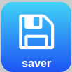

# Scroll++

**Scroll your page by one click**

# download

## [chrome extension] (https://chrome.google.com/webstore/detail/scroll%20%20/kkbkeemffgiheholedniiicjhipnpdlp?hl=nl)   >             >   [firefox extension] (https://addons.mozilla.org/en-US/firefox/addon/scroll/)

# Howto use
 

**Scroll**
Scrolls down until you will scroll down the page each 200 ms, it will stop with your mousewheel.

**Save**
This will save your page in a .mhtml, with a extension "date_tile".

**Click**
This will work in facebook. First scroll down te page, after it this button will click all "See more" links. It experimental.

**Scroll++ is still an experiment** 

Please submit an Issue when you have problems or requests.

**TODO**
- one source for Firefox and Chrome
- printly frienly option
- facebook friend options
- getting input what options need to be build in.

# screenshot

